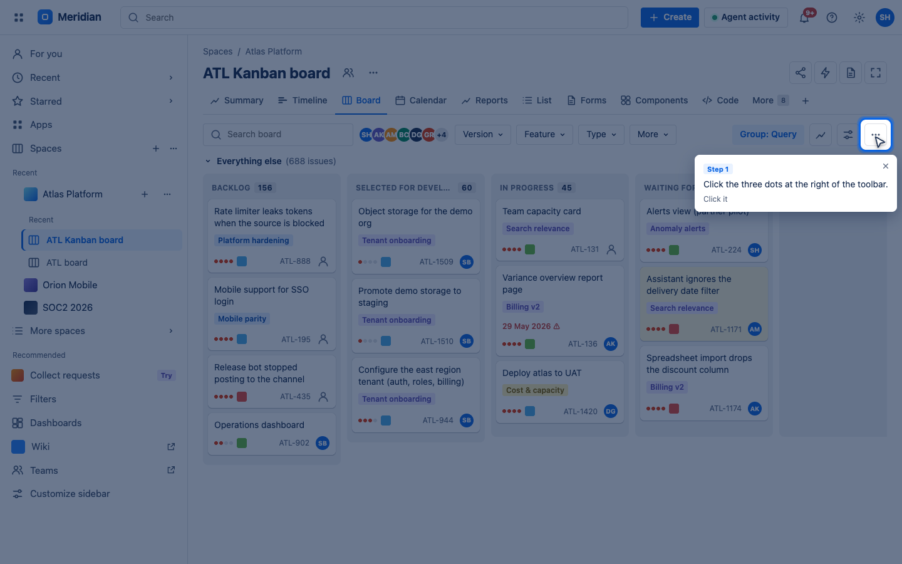
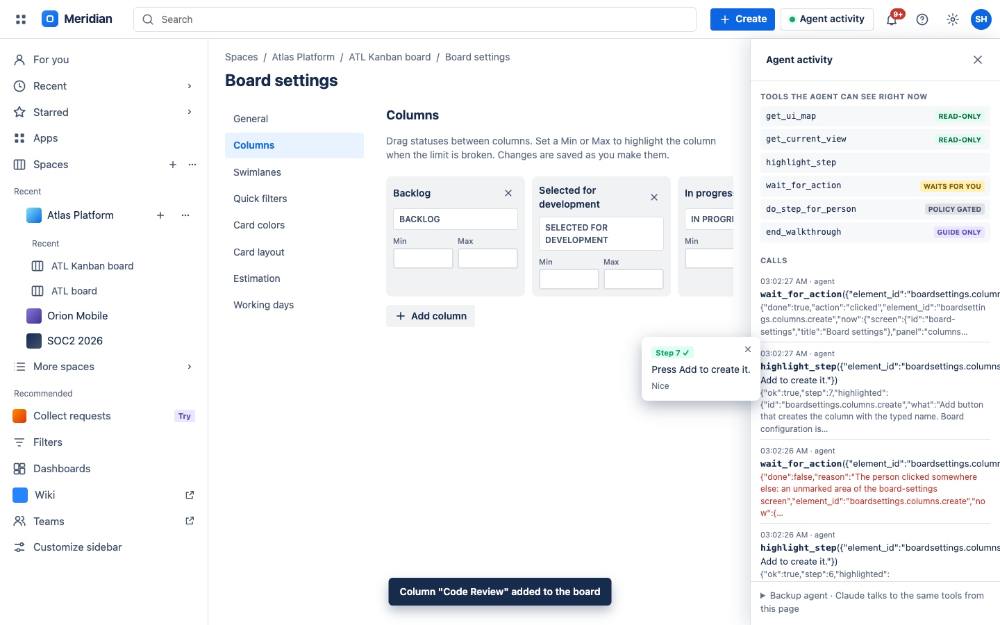

# ShowMe · agents that teach instead of doing

A WebMCP layer that turns any web app into something an AI agent can **teach** rather than operate. The agent understands your question, the site publishes a map of its own interface, and the agent lights up the path one step at a time. You do every click. Nothing changes unless your hand changes it.

The demo app is **Meridian**, a fictional Jira-style tracker with the usual maze: board settings behind a three-dots menu, project settings behind another, an issue panel whose Labels field lives inside a collapsed Details section, a type icon that does not look like a button, and a watchers menu hiding behind an eye icon.



## Why

Every "how do I…" today ends one of two ways: a help article that says *go to Settings › Columns* while your screen looks nothing like the article, or an agent that offers to do it for you, so you learn nothing and the site has to trust a robot with its configuration.

ShowMe is the third option. The site exposes six small WebMCP tools. With them an agent can find out where you are, spotlight the next element with a one-line message, wait until you actually do the step, and adapt when you click somewhere else. The site decides which steps an agent may ever do on your behalf (navigation, search boxes) and which stay human (anything that changes configuration).

## Try it in two minutes

**ChatGPT desktop app** (WebMCP built in): open the deployed URL in ChatGPT's browser, click **Site tools** in the address bar to see the six tools, then ask:

1. `How do I add a "Code Review" column to this board?`
2. `How do I add the label "needs-design" to ATL-136?` (the Labels field hides inside a collapsed Details section of the issue panel)
3. `ATL-136 is actually a bug. How do I change its type?` (the type icon next to the key is a button, nobody knows)
4. `How do I add Ana as a watcher on ATL-224?`
5. `Who gets an email when an issue is assigned, and how do I add all watchers?`
6. `How do I set a WIP limit of 5 on In progress?`

Follow the spotlight. Click the wrong thing on purpose once, the agent notices. Ask it to *just do it for me* on the final Add or Save button and watch Meridian refuse.

**Google Chrome 149+**: enable `chrome://flags/#enable-webmcp-testing`, open the URL, and drive the tools with Chrome DevTools (Application › WebMCP) or the [Model Context Tool Inspector](https://github.com/GoogleChromeLabs/webmcp-tools) extension. The **Agent activity** button in the top bar shows what the agent sees and every call it made.

**Locally**:

```
npm install
npm start          # http://localhost:8080
npm test           # Playwright walkthrough against your installed Chrome, screenshots in test/shots
```

## How WebMCP is used

| Tool | What it does | WebMCP detail |
|---|---|---|
| `get_ui_map` | Every screen, panel, menu and element with ids and short guiding rules | `readOnlyHint: true` |
| `get_current_view` | Screen, panel, open menu or dialog, visible ids, walkthrough state, app data snapshot | `readOnlyHint`, `untrustedContentHint` (echoes user-typed values) |
| `highlight_step` | Dims the page, spotlights one element, shows a message; explains what to open first if the element is hidden | descriptive errors so the model self-corrects |
| `wait_for_action` | Long-running: resolves when the person clicks, ticks or types into the element; `done:false` with a reason if they click elsewhere, the element disappears, or `timeout_seconds` pass | honours the `AbortSignal` passed to `execute`, returns the new view for verification |
| `do_step_for_person` | Performs a step only if the site allows it; refuses configuration changes with the policy text | policy lives in the markup, not in the prompt |
| `end_walkthrough` | Clears the guide | registered with an `AbortController` only while a walkthrough is active, so the agent's tool list changes live (`toolchange`) |

All of it is in [`showme.js`](showme.js). Registration goes through `document.modelContext.registerTool`; the **Agent activity** drawer renders `document.modelContext.getTools()` and refreshes on `toolchange`, so a person can watch tools appear and disappear while the agent works.



## Making a site teachable

The library needs three attributes on the elements you want the agent to be able to point at:

```html
<button data-guide="board.more"
        data-guide-desc="More actions menu (three dots) at the far right of the board toolbar. Contains Configure board…"
        data-guide-delegable>
```

- `data-guide` is the id agents use.
- `data-guide-desc` is the sentence the agent reads. Write it the way you would explain it to a new colleague.
- `data-guide-delegable` marks steps the site allows an agent to do for the person. Omit it and the step is theirs.
- `data-guide-goto="screen-id"` says where a click leads; `data-guide-menu="opener-id"` says the element lives inside a menu; `data-guide-danger` marks irreversible actions.
- `data-screen`, `data-panel` and `data-dialog` group elements so the agent knows what has to be open first.

The map is built from the live DOM on every call, so dynamically rendered elements (the WIP limit fields for each column, the recipient checkboxes in the dialog) are included automatically.

## Backup agent

The Agent activity drawer has a small **Backup agent** panel that runs Claude directly from the page against the same tools, through `document.modelContext`. Paste an Anthropic API key (it stays in your browser's localStorage) and ask the same questions. It exists to prove the tools are agent-agnostic and as a fallback when a WebMCP browser is not at hand. It is covered by a mocked run in the test; a live run needs a key.

## Files

```
index.html          Meridian: board, board settings, project settings, dialogs, all with data-guide attributes
styles.css          Tracker look, spotlight overlay, agent drawer
app.js              Board data, rendering, hash routing, settings behaviour, guide bootstrap
showme.js           The WebMCP guide layer (tools, overlay, activity drawer)
agent-console.js    Backup agent talking to the Claude API from the page
vendor/             Google's official WebMCP polyfill (Apache-2.0), used only when document.modelContext is missing
serve.mjs           Tiny static server for npm start and the test
test/walkthrough.mjs  Playwright walkthrough: two full guides, abort on wrong click, policy refusals, dynamic tool list, backup agent
```

## Notes

- `wait_for_action` returns `still waiting` after 45 seconds by default and keeps the spotlight on, so agent runtimes with a shorter tool timeout can simply call it again. Adjust the default in `showme.js` if your runtime cuts earlier.
- The polyfill never runs when the browser implements WebMCP natively; it makes `npm test` work on a stock Chrome and lets the backup agent run anywhere.
- Meridian is fictional. Names, issues and people are invented.
- Opening `index.html` from disk shows a banner instead of the app: browsers block ES modules on `file://`, so use `npm start` or the deployed URL.

MIT © 2026 Sergio Huanca
