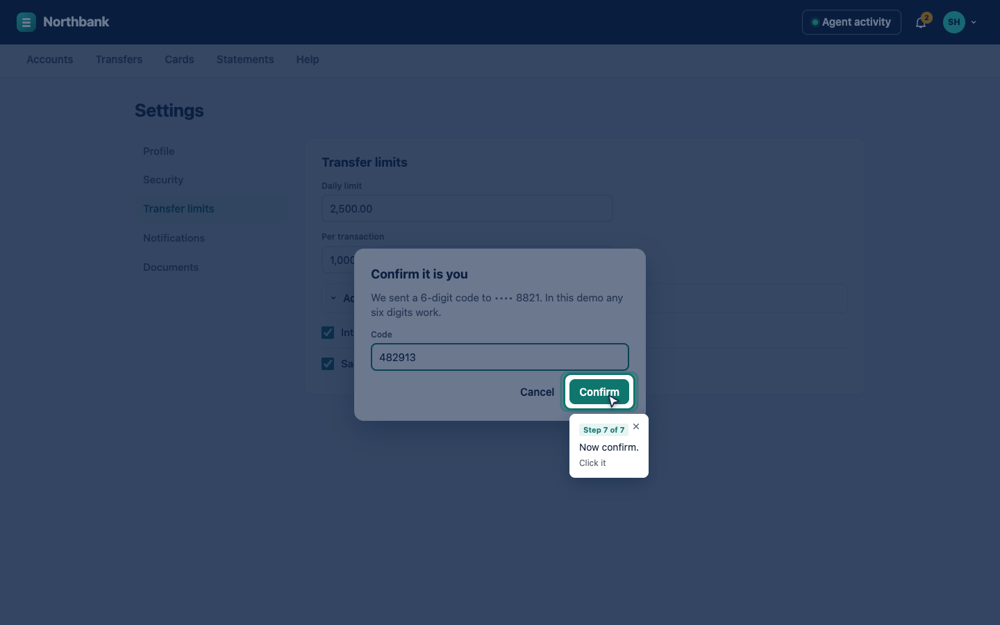
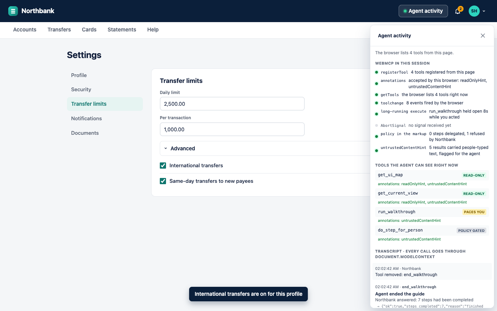
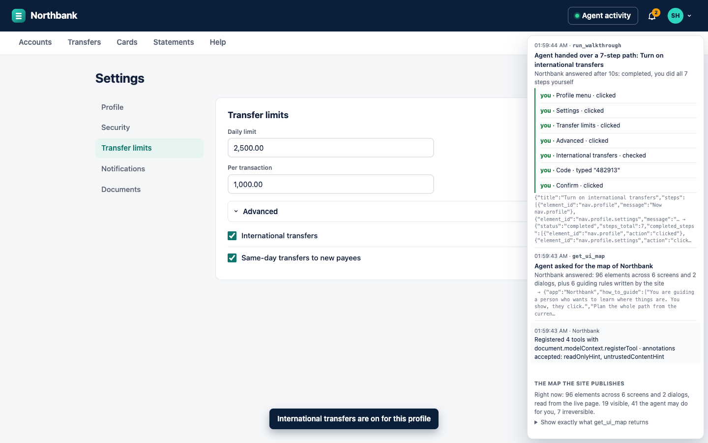

# ShowMe · agents that teach instead of doing

**Live demo:** https://sergio-huanca.github.io/showme/ is Northbank, https://sergio-huanca.github.io/showme/meridian/ is Meridian.
**Video:** I'll put the YouTube link here once it's recorded.

ShowMe is my entry for OpenAI's WebMCP Challenge. It's a small layer you add to a web app so an AI agent can show people where things are, instead of doing things for them. You ask your agent "how do I turn on international transfers?", the site hands the agent a map of its own interface, the agent plans the path and then lights up one element at a time. You do every click yourself. If you click somewhere else the page notices and the agent re-plans. Nothing on the page changes unless you changed it.

I built two fake sites to show it, and neither of them has any tour code in it:

- **Northbank** is a made-up online bank. The switch for international transfers is four levels deep (profile menu, a settings tab, a collapsed "Advanced" section), and the final Confirm is a button I never want an agent pressing. Disputing a charge is behind three dots inside a dialog. Freezing a card is behind three dots on the card.
- **Meridian** at `/meridian/` is a Jira-style tracker: board settings behind one three-dots menu, project settings behind another, a Labels field inside a collapsed section, and a type icon that nobody realises is a button.



## Why I built it

Whenever I've had to explain to someone (usually my parents, honestly) how to do something in an app, the help article never matches what's on their screen, and the "let me just do it for you" approach means they'll ask again next month. Agents make the second option worse in a way: now the site has to trust a robot with your money or your configuration, and you still didn't learn anything.

So this is a third option. The site exposes five small WebMCP tools. With them the agent can find out where you are, plan the whole path once, and hand it to the page. The page then spotlights one element at a time and moves on the moment you've done the step. There's no model latency between steps because the model isn't in the loop between steps. The agent plans, the page paces.

The site also decides which steps an agent is ever allowed to do for you (open a menu, type in a search box) and which ones stay yours (anything that moves money or changes configuration). That policy lives in the markup, not in a prompt. For the actions where a confirmation dialog isn't really enough, the person performs the action, full stop.

## Who it's for

Support teams first. "Where is X" is the question help centers answer over and over, and the answer never matches the reader's screen. With this the site answers on the reader's own screen, and the sentences it needs are the ones the help center already wrote.

Then regulated products: banks, health portals, admin consoles. Places where an agent shouldn't act but the person still needs help. That's what Northbank is for. The agent can teach you how to move your money without being able to move your money.

And anyone learning a tool. A new hire on the team tracker, a parent on online banking. That's Meridian. You do every step, the agent says the path back to you in one line at the end, and the second time you probably don't need it.

## Try it

**In the ChatGPT desktop app** (its browser has WebMCP built in): open the live URL in ChatGPT's browser, click **Site tools** in the address bar to see what the site exposes, and ask. A small card on each site suggests a first question. Close it and it stays closed.

Northbank:

1. `How do I turn on international transfers?` Profile menu, settings tab, collapsed section, toggle, confirmation code.
2. While the profile menu is lit: `Just do it for me.` Northbank lets the agent open a menu. When Confirm lights up, ask again. Northbank refuses, the agent explains, you press it.
3. Now switch it off yourself, no agent: profile menu › Settings › Transfer limits › Advanced. Four clicks. That's the part I actually care about.
4. `Lumen Coffee charged me twice. How do I dispute it?` The dispute form is behind three dots inside the transaction dialog.
5. `What did I spend this week?` One merchant descriptor in the list carries instructions for the agent. It only reaches the agent through a result flagged `untrustedContentHint`, and even a fooled model couldn't move money, because Transfer is marked irreversible in the markup.

Meridian:

1. `How do I add the label "needs-design" to ATL-136?` The Labels field is inside a collapsed Details section.
2. `How do I add a "Code Review" column to this board?`
3. `ATL-136 is actually a bug. How do I change its type?` The type icon next to the key is a button.
4. `Who gets an email when an issue is assigned, and how do I add all watchers?`

Click the wrong thing on purpose once and watch the agent notice. Open **Agent activity** before you ask and the scoreboard lights up as things happen.

**In Chrome 149+**: turn on `chrome://flags/#enable-webmcp-testing`, open the URL, and call the tools from DevTools (Application › WebMCP) or the [Model Context Tool Inspector](https://github.com/GoogleChromeLabs/webmcp-tools) extension. There's also a `check.html` next to the sites that tells you whether the browser you're in has the API at all.

**Locally**:

```
npm install
npm start          # http://localhost:8080 is Northbank, http://localhost:8080/meridian/ is Meridian
npm test           # Playwright drives both sites through document.modelContext in your installed Chrome; screenshots land in test/shots
```

## How WebMCP is used

| Tool | What it does | WebMCP detail |
|---|---|---|
| `get_ui_map` | Every screen, panel, menu and element, with ids and a few guiding rules, read from the live DOM | `readOnlyHint`, `untrustedContentHint` (merchant names, column names and issue titles are typed by people) |
| `get_current_view` | Screen, panel, open menu or dialog, visible ids, walkthrough state, a snapshot of app data | `readOnlyHint`, `untrustedContentHint` |
| `run_walkthrough` | Takes the whole path. The page spotlights each element with the agent's message, waits for the person to click, tick or type, then moves on by itself. Returns `completed`, `interrupted` with the reason (wrong click, stopped), `blocked` when a step isn't reachable, or `in_progress` after `timeout_seconds` while the walkthrough keeps running | long-running `execute` that honours the `AbortSignal`; returns what the person did and the new view, so the agent verifies instead of guessing; `untrustedContentHint` because the view echoes people-typed text |
| `do_step_for_person` | Performs a step only if the site allows it; refuses money moves and configuration changes with the policy text | the policy lives in the markup, not in the prompt; `untrustedContentHint` |
| `end_walkthrough` | Clears the guide | registered with an `AbortController` only while a walkthrough is active, so the agent's tool list changes live (`toolchange`) |

Registration goes through `document.modelContext.registerTool`. If a browser rejects an annotation, the tool gets registered again without it and the drawer tells you. Nothing in the page talks to the tools except through that API; the test discovers them with `getTools()` and runs them with `executeTool()`.

Something that confused me at first: the agent's call log is really short. It reads the map once and calls `run_walkthrough` once per path, and everything interesting happens inside that one call. So the drawer shows what's going on inside it. The **WebMCP in this session** scoreboard has one line per API feature, and a line only lights up once that thing has actually happened: tools registered and which annotations the browser accepted, what `getTools` lists, `toolchange` events, how many seconds the long-running call has been open while you act, abort signals, steps delegated or refused by the markup, results flagged as people-typed text. Under it there's a transcript that reads like a conversation: what the agent asked, what the site answered, how long it took, and every click, tick and keystroke you did. The panel floats over the page like a dropdown instead of pushing it around, and if a spotlighted step happens to sit underneath it, the panel fades out and lets the click through until the next step.





## How it's different from what exists

| | Help article | Scripted tour (Pendo, Intro.js) | Screen-reading agent | ShowMe on WebMCP |
|---|---|---|---|---|
| Who plans the path | a writer, once | the site, one tour at a time | the model, from pixels | the agent, from the site's own map, for any question |
| Matches your screen | no | for the tours the site wrote | mostly | yes, read from the live DOM on every call |
| Waits for you to do the step | no | yes | no, it acts or guesses | yes, as a structured tool result |
| Knows what you did | no | yes | no | yes: clicked, typed what, chose what |
| Site decides what an agent may do | n/a | n/a | no | yes, in the markup |
| Works with any agent | n/a | n/a | one vendor | any agent in a WebMCP browser |

Microsoft's Copilot Vision "Highlights" is the closest thing I know of, and it proved people want "show me how". But it works from screen pixels, for one assistant, and it can't know whether you did the step or whether the site would even let an agent do it.

## Reading the code

It's all in [`showme.js`](showme.js), about 750 lines of vanilla JavaScript, no build step. If you only have five minutes, read `register()`, `runWalkthrough()` and `doStep()`.

- `uiMap()` and `describe()` build the map from `data-guide` attributes in the live DOM. `whyHidden()` works out, for an element that isn't visible, what has to be opened first, and says so in a sentence the agent can act on.
- `register()` registers a tool through `document.modelContext.registerTool`, retries without an annotation the browser rejects, and wraps `execute` so every call, how long it took and whether it got an `AbortSignal` end up in the transcript.
- `runWalkthrough()` is the long-running tool. It starts `drive()`, which spotlights and waits step by step on the page, and it resolves when the path completes, gets interrupted, `timeout_seconds` pass, or the signal aborts. `waitFor()` is the wait for one real human action on one element.
- `startWalk()` registers `end_walkthrough` with an `AbortController`; `endWalk()` aborts it, so the tool disappears and `toolchange` fires. `startGuide()` listens for `toolchange` and re-renders the tool list.
- `doStep()` is the policy: `data-guide-danger` is never done by an agent, `data-guide-delegable` may be, everything else belongs to the person.
- `renderScore()` and `renderCalls()` draw the scoreboard and the transcript.

## Making your own site teachable

Two files and three attributes, more or less. Link the layer, start it with the app's name and a snapshot of its state, and mark the elements you want the agent to be able to point at:

```html
<link rel="stylesheet" href="showme.css">
<script type="module">
  import { startGuide } from './showme.js'
  startGuide({ app: 'Northbank', state: () => ({ international_transfers: 'off' }) })
</script>

<button data-guide="settings.limits.advanced"
        data-guide-desc="Advanced section header on the Transfer limits page. Collapsed by default; expand it to reach International transfers"
        data-guide-delegable>
```

- `data-guide` is the id agents use.
- `data-guide-desc` is the sentence the agent reads. Write it the way you'd explain it to a new colleague. If you have a help center, you've already written these.
- `data-guide-delegable` marks steps the site allows an agent to do for the person. Leave it off and the step is theirs.
- `data-guide-goto="screen-id"` says where a click leads, `data-guide-menu="opener-id"` says the element lives inside a menu, `data-guide-danger` marks things that can't be undone, which are never delegated.
- `data-screen`, `data-panel` and `data-dialog` group elements so the agent knows what has to be open first.

The map is rebuilt from the live DOM on every call, so anything rendered dynamically (transaction rows, the WIP limit fields for each column, the checkboxes in a dialog) is included without doing anything. The overlay and the drawer take their colours from `--showme-*` variables, which is why the spotlight is teal on Northbank and blue on Meridian with the same two files. `startGuide({ hint, also })` shows the little first-visit card that suggests a question.

One honest caveat: the layer also expects menus to be `.menu` elements with a `data-menu` attribute and hidden things to use the `hidden` attribute, because that's how I built Northbank and Meridian. I haven't tried it on a site built some other way yet.

## What I deliberately didn't use

- **Declarative tools** (`<form toolname>`). ChatGPT's browser only supports the imperative API, and a walkthrough isn't a form submission anyway.
- **Cross-origin tools** (`exposedTo`, `allow="tools"` iframes). Not in ChatGPT's browser, and the layer lives in the page it annotates.
- **`requestUserInteraction`**. Still a proposal. The refusal policy in `do_step_for_person` is the version that works today.

## What I'd do next

- Scoped maps. `get_ui_map` dumps the whole site, which is about 20K characters on Northbank and 40K on Meridian. That's more than I'd like. The fix is to return the list of screens plus the current screen's elements, and let the agent fetch other screens on demand.
- `requestUserInteraction` once browsers ship it, so the browser does the waiting instead of the page.
- Declarative tools for the two read-only tools, once ChatGPT's browser supports them.

## Files

```
showme.js           the WebMCP guide layer: map, tools, walkthrough, overlay, Agent activity drawer
showme.css          the layer's styles, themed through --showme-* variables
index.html          Northbank: accounts, transfers, cards, settings, transaction and confirmation dialogs, all with data-guide attributes
app.js, styles.css  Northbank's data, rendering, hash routing and look
meridian/           Meridian: board, board settings, project settings, issue panel, dialogs, same conventions
check.html          tells you whether the browser you're in exposes document.modelContext
vendor/             Google's WebMCP polyfill (Apache-2.0); the test injects it, the pages never load it
serve.mjs           tiny static server for npm start and the test
test/walkthrough.mjs  Playwright walkthrough on both sites: four full guides, the wrong-click recovery, the policy refusals, the dynamic tool list, the scoreboard and transcript
```

## Notes

- `run_walkthrough` returns `in_progress` after 40 seconds by default while the walkthrough keeps running on the page, so a runtime with a shorter tool timeout just calls it again. If yours cuts earlier, change the default in `showme.js`.
- Why one call for the whole path: my first version did one spotlight per call, and in ChatGPT every round trip cost 10 to 20 seconds of model time, so the person sat there waiting between every click. Handing the whole plan to the page fixed that. The next spotlight appears the instant you finish the previous step.
- The pages only ever talk to `document.modelContext`. `npm test` injects Google's polyfill into the test browser so the walkthrough runs on a stock Chrome.
- Northbank and Meridian are fakes I built for this. Names, balances, issues and people are invented. Nothing leaves your browser.
- Opening the HTML files from disk shows a banner instead of the app, because browsers block ES modules on `file://`. Use `npm start` or the live URL.

MIT © 2026 Sergio Huanca
